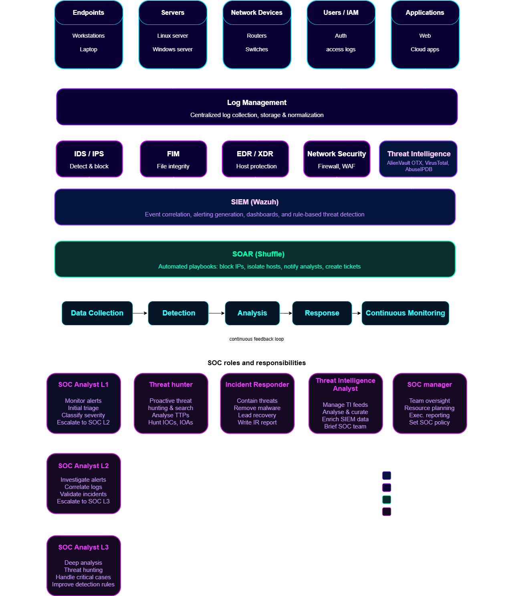
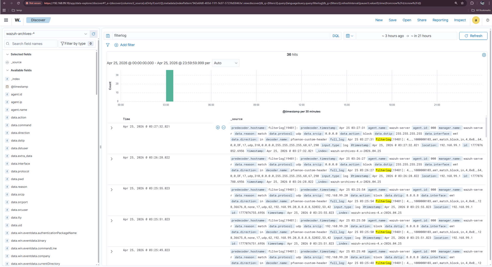
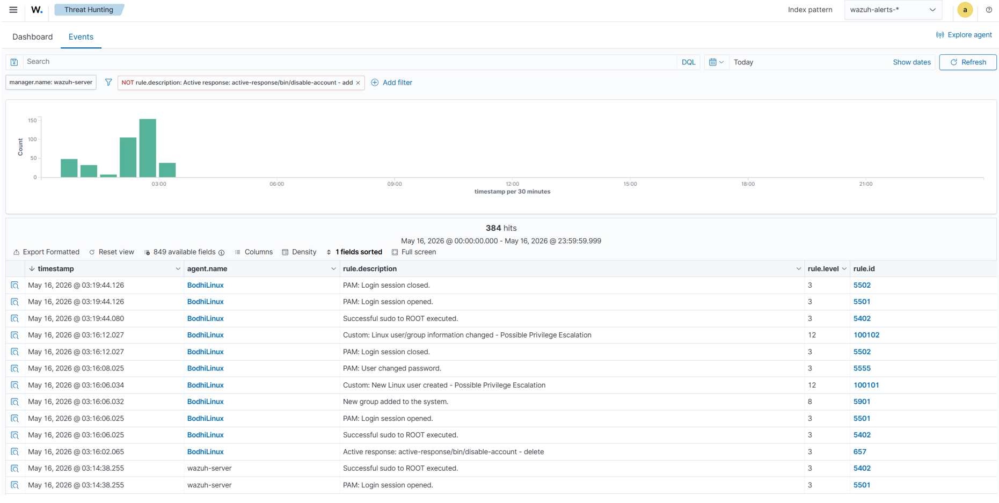
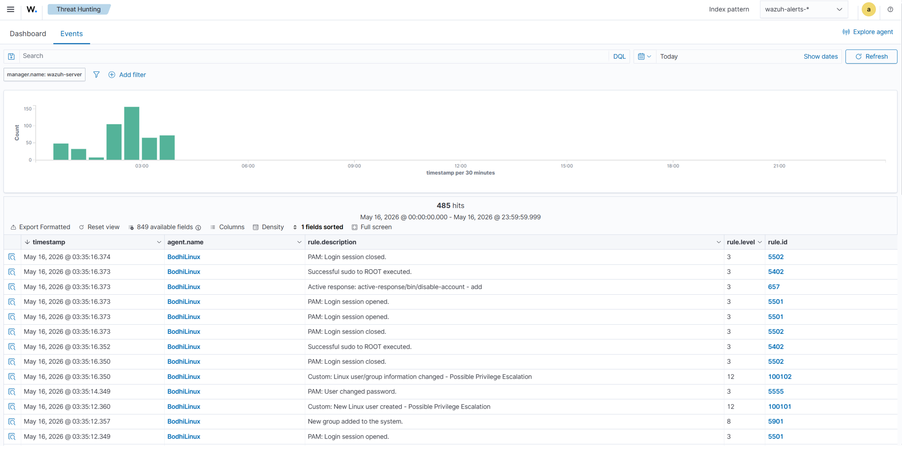
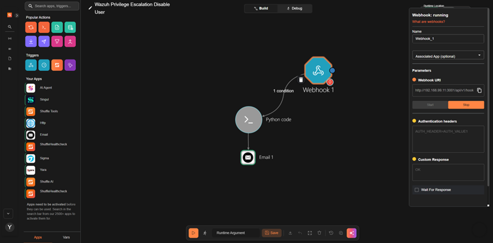

# 🛡️ Wazuh XDR, SOAR & Threat Intelligence Lab

**An enterprise-style SOC lab: Wazuh SIEM/XDR for detection, Shuffle for SOAR automation, and VirusTotal, AbuseIPDB, and AlienVault OTX for threat intelligence enrichment.**


---

## 📖 Table of Contents

- [Overview](#-overview)
- [Lab Environment](#️-lab-environment)
- [Technologies Used](#-technologies-used)
- [SOC Architecture](#️-soc-architecture)
- [Security Operations Workflow](#-security-operations-workflow)
- [Implementation Walkthrough](#-implementation-walkthrough)
- [Key Results](#-key-results)
- [Skills Demonstrated](#-skills-demonstrated)
- [Repository Structure](#-repository-structure)
- [Lessons Learned](#-lessons-learned)
- [Possible Next Steps](#-possible-next-steps)
- [License](#-license)

---

## 📋 Overview

Most home-lab security projects stop at "I set up a SIEM and got an alert." This project goes a step further and builds the **full SOC loop** an actual analyst works inside: collect telemetry → detect → investigate → respond → enrich with external intelligence → feed lessons back into detection logic.

**Wazuh** is the core SIEM/XDR platform, ingesting logs from Windows, Linux, and a perimeter firewall. **Shuffle** handles SOAR automation, turning a raw alert into an orchestrated response instead of a ticket sitting in a queue. Three threat intelligence sources — **VirusTotal**, **AbuseIPDB**, and **AlienVault OTX** — enrich alerts with real-world reputation data so triage decisions aren't made in a vacuum.

**Why this matters:** In a real SOC, detection without response is just noise, and response without intelligence is guesswork. This lab was built specifically to demonstrate that connective tissue — showing an attack from initial telemetry through automated containment, with threat intel woven into the investigation at each step.

---

## 🖥️ Lab Environment

| System | Role | Purpose |
|---|---|---|
| **Wazuh Server** | SIEM / XDR | Central log aggregation, correlation, and detection |
| **Windows Server 2022** | Monitored endpoint | Primary attack target, Active Response testing |
| **Bodhi Linux** | Monitored endpoint | Cross-platform agent validation |
| **Kali Linux** | Attacker host | Simulated privilege escalation / intrusion attempts |
| **pfSense Firewall** | Perimeter defense | Syslog source for network-level visibility |
| **Shuffle** | SOAR platform | Automated incident response workflows |

---

## 🧰 Technologies Used

| Category | Tools |
|---|---|
| **Security Monitoring** | Wazuh SIEM, custom detection rules, Wazuh Active Response |
| **Operating Systems** | Windows Server 2022, Bodhi Linux, Kali Linux |
| **Network Security** | pfSense Firewall, Syslog |
| **SOAR** | Shuffle, webhook-triggered workflows |
| **Threat Intelligence** | VirusTotal, AbuseIPDB, AlienVault OTX |
| **Scripting** | PowerShell, Bash, Python |

---

## 🏗️ SOC Architecture



Endpoints and network devices forward logs into Wazuh, which correlates events against custom detection rules. Matches above a defined severity threshold trigger either a Wazuh Active Response action locally, or a webhook to Shuffle for a broader orchestrated response — which can include threat intel lookups against the alert's IOCs.

---

## 🔄 Security Operations Workflow

```
 1. Data Collection      Endpoint + firewall logs streamed into Wazuh
          │
 2. Detection             Custom rules match on suspicious behavior
          │
 3. Analysis              Alert enriched with threat intel context
          │
 4. Response               Active Response / Shuffle playbook executes
          │
 5. Continuous Monitoring  Findings feed back into detection tuning
```

---

## 📌 Implementation Walkthrough

### Task 1 — Wazuh Deployment & Event Validation

**Wazuh Dashboard** — Centralized visibility into events, alerts, and agent health across the environment.


**Agent Enrollment** — Windows Server 2022 and Bodhi Linux enrolled and confirmed actively reporting.


**Perimeter Visibility** — pfSense firewall logs forwarded to Wazuh via Syslog, closing the gap between endpoint and network telemetry.



---

### Task 2 — XDR Detection & Automated Response

**Detecting Privilege Escalation** — Custom rules `100101` and `100102` were written to catch unauthorized privilege escalation attempts on the Windows endpoint — the kind of behavior that's often the first sign of a compromised account being used to move laterally.



**Automated Containment** — Rather than waiting on an analyst to manually disable the account, Wazuh's Active Response fires automatically the moment the rule matches, cutting the window of exposure from minutes to seconds.



---

### Task 3 — SOAR Automation with Shuffle

**Incident Response Workflow** — Wazuh alerts are pushed to Shuffle via webhook, where an automated workflow takes over: parsing the alert, pulling relevant IOCs, and kicking off downstream actions — removing manual, repetitive triage work from the analyst's plate.



---

### Task 4 — Threat Intelligence Integration

| Source | Rule IDs | Purpose |
|---|---|---|
| **VirusTotal** | `87105`, `100092` | File hash / binary reputation checks |
| **AbuseIPDB** | `100004` | IP reputation scoring for suspicious connections |
| **AlienVault OTX** | `100220`, `100300`, `100301` | IOC and domain matching against open threat exchange pulses |

**VirusTotal** — Suspicious binaries are automatically checked against VirusTotal's multi-engine scan results before an analyst has to manually pivot to a separate tool.


**AbuseIPDB** — Connections from external IPs are scored for abuse history, adding context that raw firewall logs alone can't provide.


**AlienVault OTX** — Domains and IOCs observed in alerts are cross-referenced against OTX threat pulses, flagging known-bad infrastructure.


---

## ✅ Key Results

| Capability | Status |
|---|:---:|
| Wazuh Deployment | ✅ |
| Windows Agent Integration | ✅ |
| Linux Agent Integration | ✅ |
| pfSense Syslog Integration | ✅ |
| Custom Detection Rules | ✅ |
| XDR Detection | ✅ |
| Active Response (Auto-Containment) | ✅ |
| Shuffle SOAR Automation | ✅ |
| VirusTotal Integration | ✅ |
| AbuseIPDB Integration | ✅ |
| AlienVault OTX Integration | ✅ |

---

## 🎯 Skills Demonstrated

- **SIEM Engineering** — Wazuh deployment, log source onboarding, custom rule authoring, event correlation
- **XDR & Endpoint Defense** — cross-platform agent management, Active Response configuration
- **SOAR** — Shuffle workflow design, webhook integration, automated response orchestration
- **Threat Intelligence** — multi-source IOC enrichment (file, IP, domain), reducing manual triage time
- **Security Operations** — end-to-end incident lifecycle, from detection through automated containment
- **Network Security** — firewall log integration, perimeter-to-endpoint visibility

---

## 📂 Repository Structure

```
threat-intelligence-threat-hunting-wazuh/
│
├── README.md
├── LICENSE
├── .gitignore
│
└── images/
    ├── soc-architecture.png
    ├── wazuh-dashboard.png
    ├── agents-connected.png
    ├── pfsense-syslog.png
    ├── privilege-escalation-alert.png
    ├── account-disabled.png
    ├── shuffle-workflow.png
    ├── virustotal-detection.png
    ├── abuseipdb-enrichment.png
    └── otx-match.png
```

---

## 💡 Lessons Learned

- **Detection is only as good as the rule tuning behind it** — the privilege escalation rules went through several iterations to reduce false positives before they were reliable enough to trigger Active Response automatically.
- **Automation needs guardrails** — Active Response is powerful but risky if a rule is too broad; scoping it tightly to a specific, well-tested trigger condition was essential before enabling automatic account lockout.
- **Threat intel is only useful if it's fast** — enrichment lookups need to complete within the analyst's triage window, or they just become extra noise reviewed after the fact.

---

## 🔭 Possible Next Steps

- Map each detection rule to its corresponding MITRE ATT&CK technique for a coverage matrix
- Add a second attack chain (e.g., lateral movement or data exfiltration) to demonstrate multi-stage detection
- Export sample Wazuh rule XML and the Shuffle workflow JSON as reusable reference artifacts
- Add a false-positive tuning log to show the rule refinement process over time

---

## 📄 License

Shared under the [MIT License](LICENSE) — feel free to reference the structure and approach for your own SOC lab projects.

## 👤 Author

**0xcgz** — [github.com/0xcgz](https://github.com/0xcgz)
